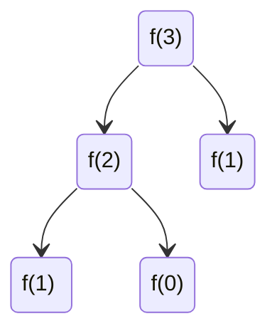

# 演算法介紹

## 什麼是演算法
>[!info]+
>演算法是用於解決特定問題的一系列步驟

## 如何評價一個算法的好壞

### 統計時間 
- 雖然直觀，但須自己編寫測試代碼，並且無統一性
- 無公正性：根據硬體，平台不同效能上有差異
可參考[[TimeTool]]

### 公正的判斷
- 正確性
- 可讀性
- 健壯姓(對不合理輸入的處理)
- 時間複雜度
- 空間複雜度
>使用不同算法，解決同一問題，效率可能相差非常大

## 空間/時間複雜度
**Time complexity:**
**BigO:**
- 時間: 估算程式碼執行次數，以最高次方為主
- 空間: 計算存儲耗費
數據規模:
- n 代表資料量也就是數據規模
- 多數具規模表示O(n+k)

### Example 複雜度
```java
while((n = n/2) > 0){
	System.out.println("test");
}
```
執行次數為log(n) 複雜度為 O(logn)
>複雜度與迭帶次數 、數據規模有關

### 常見複雜度
| 執行次數                                                                                                                                                                                                                                   | 複雜度                                              | 術語    |
|:---------------------------------------------------------------------------------------------------------------------------------------------------------------------------------------------------------------------------------------|:------------------------------------------------:|:-----:|
|                                                                                                                                                                                                                                     12 | O(1)                                             | 常數    |
|                                                                                                                                                                                                                                   2n+3 | O(n)                                             | 線性    |
|                                                                                                                                                                                                                   4log$_{2}$&nbsp;+ 25 | O(logn)                                          | 對數    |
| <div>3n+2nlog$_{3}$n</div> | O(nlogn)                                         | nlogn |
|                                                                                                                                                                                                                            4$n^2$ + 2n | O(<span style="text-align: start;">$n^2$</span>) | 平方    |
|                                                                                                                                                                                                                                 5$n^3$ | O(<span style="text-align: start;">$n^3$</span>) | 立方    |
| $2^n$                                                                                                                                                                                                                                  | O(<span style="text-align: start;">$2^n$</span>) | 指數    |  

![[complexity.png|800]]
>設 **n 為無限大** 時，`1 < log n < n < n log n < n^2 < n^3 < 2^n < n!` 
### Example Fibonacci
index: 0 1 2 3 4 5
out  : 0 1 1 2 3 5

Example: recursion of fibnoacci
```java
public static int fib(int n) {
	if(n<=1) 
		return n;
	return fib(n-1) + fib(n-2);
}
```
### fib 複雜度分析

透過上圖可知 f(3) 執行4次, 複雜度：**2<sup>n-1</sup> -> O(2<sup>n</sup>)**
- 此複雜度太大，會有性能問題
>實際上fib不是以2倍進行增長，但以複雜度觀點來看是可以視為2倍的指數增長
- fib(64) 需要做2<sup>63</sup>次，而電腦現在普遍4Ghz10線程，每秒約4x10x10<sup>9</sup>≈2<sup>35</sup>次
>2<sup>64</sup>÷2<sup>35</sup>秒 = 2<sup>29</sup>秒≈2<sup>4</sup>年≈16年

![[fib.png|800]]
>第五階時減少 16 -> 10

### 關於複雜度種類
- 最好最壞複雜度
- 均攤複雜度
- 複雜度震盪
- 平均複雜度

>[!info]+
>陣列擴容時擴容與縮容相乘倍數為1將造成複雜度震盪
參考:[[Array]]

## 算法優化方向
- 空間換時間
- 時間換空間

### Example 空間換時間
```java
public static int arr[100];
public static int fib(int n) {
	if(n<=1) 
		return n;
	else if(arr[n]!=null){
		return n;
	}
	arr[n] = fib(n-1) + fib(n-2);
	return arr[n];
}
```

### Example 遞迴換迴圈
```java
public static int fib(int n) {
	int first = 0, second = 1;
	while(n-- > 0){
		second += first;
		first = second - first;
	}
	return second;
}
```

