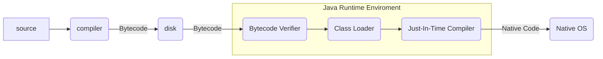

# Java 介紹
***
## 三種JAVA
- Java Standard Edition
- Java Enterprise Edition
	- large-scale
	- distributed networking
	- web-based
- Java Micro Edition
	- Subset of Java SE
	- resource-constrained embedded devices
		- Smartwatches

## JRE vs JAVA SE vs JDK

- Java SE(Java Platform, Standard Edition)
	- 通常為開發者使用
	- 有debug的功能
- JRE(Java 執行階段環境): 
	- 通常給一般使用者使用
- JDK(Java開發工具組)
	- 包含IDE

## Compiler

