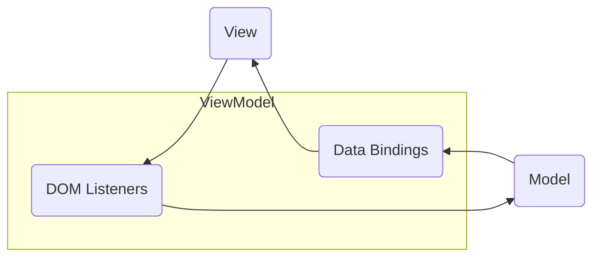

# vuejs
***
- 底層核心為TypeScrip(TypeScript 向 JavaScript 添加額外的語法)
- Single File Components (SFCs, aka .vue files) with

## MVC vs MVVM mode

```mermaid
graph RL;
	b(Model)
	subgraph ViewModel
		c(DOM Listeners) & d(Data Bindings)
	end
	a(View)

	a --> c
	c --> b
	d --> a
	b --> d

```

