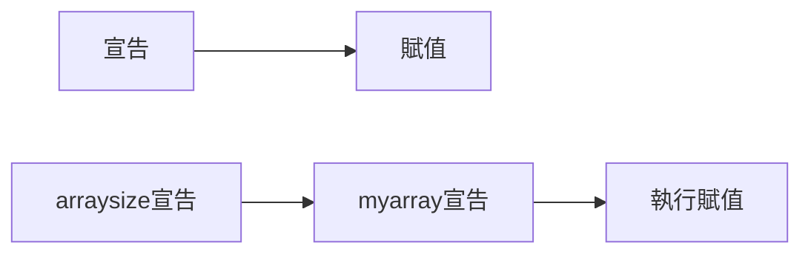

# C++ 編譯器
***
# 編譯器
編譯器執行步驟
```cpp
int arraysize = 10;
int myarray[arraysize];
```


編譯時宣告，執行時賦值

***
## 多重編譯
Ex:

```cpp
g++ -c AirTicket.cpp
g++ -c main.cpp
g++ -o prog AirTicket.o main.o
ls
```
-c compile
-o output
ls AirTicket.cpp AirTicket.h AirTicket.o main.cpp main.o prog
>ls:列出所有編譯器的處理

***
## Makefile
Ex:
```cpp
prog: AirTicket.o main.o
	g++ -o prog AirTicket.o main.o
AirTicket.o: AirTicket.cpp
	g++ -c AirTicket.cpp
main.o: main.cpp
	g++ -c main.cpp
```

也可以直接使用 g++ -o prog AirTicket.cpp main.cpp，編譯器也能執行
寫好makefile後使用make指令
>mingw32-make

## g++ 選擇標準
- `-std=C++14` : 使用C14標準編譯
```
g++ -std=c++14 source.cpp
```

可參考：[auto 編譯](https://blog.gtwang.org/programming/cpp-auto-variable-tutorial/)
***


